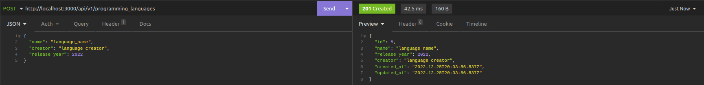
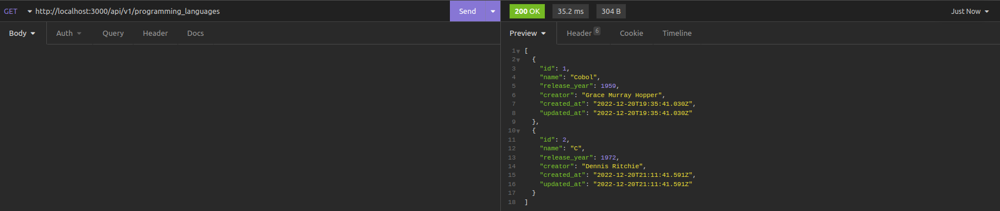
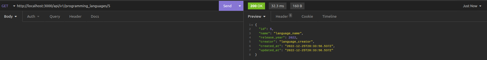

# Criando uma API REST usando Ruby on Rails

Este repositório contém todos arquivos de uma API REST desenvolvida por _[Wesley Oliveira Maia](https://www.linkedin.com/in/wesley-maia-433b7b60/)_ com base no projeto do Desenvolvedor Lucas Caton ([LIVE #012](https://www.youtube.com/watch?v=jcA_Nn2xPXg)). Essa API é utilizada para cadastrar linguagens de programação, possuindo uma única tabela (programming_languages) com os seguintes atributos: *name*, *creator* e *release_year*.

## Ferramentas Utilizadas

 1. Framework: Ruby on Rails
 2. Banco de Dados: SQLite
 
## Setup Inicial

Antes de iniciar o servidor Puma, execute o comando abaixo para configurar e alimentar o banco de dados:

```ruby
rails dev:setup
```

## Lista de Requisitos

### 1 - Criar um endpoint para o cadastro de linguagens de programação
- O endpoint deve ser acessível através do caminho (`/programming_languages`);
- Os produtos enviados devem ser salvos em uma **collection** do MongoDB;
- O endpoint deve receber a seguinte estrutura:

```json
{
  "name": "language_name",
  "creator": "language_creator",
  "release_year": 2022
}
```

O retorno da API de um produto cadastrado com sucesso deverá ser:

```json
{
  "id": 5,
  "name": "language_name",
  "release_year": 2022,
  "creator": "language_creator",
  "created_at": "2022-12-25T20:33:56.537Z",
  "updated_at": "2022-12-25T20:33:56.537Z"
}
```



### 2 - Criar um endpoint para listar todas as linguagens de programação cadastradas
- O endpoint deve ser acessível através do caminho (`/programming_languages`);
- Através do caminho `/programming_languages`, todos as linguagens de programação devem ser retornados.



### 3 - Criar um endpoint para listar uma linguagem de programação cadastradas
- O endpoint deve ser acessível através do caminho (`/programming_languages/:id`);
- Através do caminho `/programming_languages/:id`, apenas o registro com o `id` presente na URL deve ser retornado;


