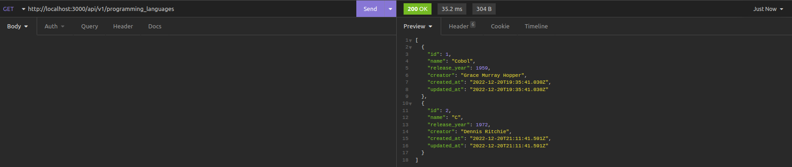

# Criando uma API REST usando Ruby on Rails

Este repositório contém todos arquivos de uma API REST desenvolvida por _[Wesley Oliveira Maia](https://www.linkedin.com/in/wesley-maia-433b7b60/)_ com base no projeto do Desenvolvedor Lucas Caton ([LIVE #012](https://www.youtube.com/watch?v=jcA_Nn2xPXg)). Essa API é utilizada para cadastrar linguagens de programação, possuindo uma única tabela (programming_languages) com os seguintes atributos: *name*, *creator* e *release_year*.

## Ferramentas Utilizadas

 1. Framework: Ruby on Rails
 2. Banco de Dados: SQLite
 

## Lista de requisitos

### 1 - Criar um endpoint para listar todas as linguagens de programação cadastradas
- O endpoint deve ser acessível através do caminho (`/programming_languages`);
- Através do caminho `/products`, todos os produtos devem ser retornados.

